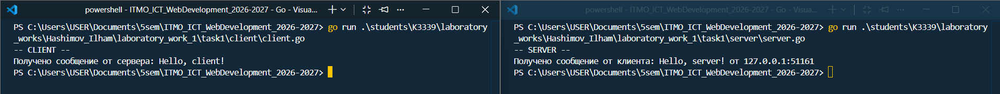
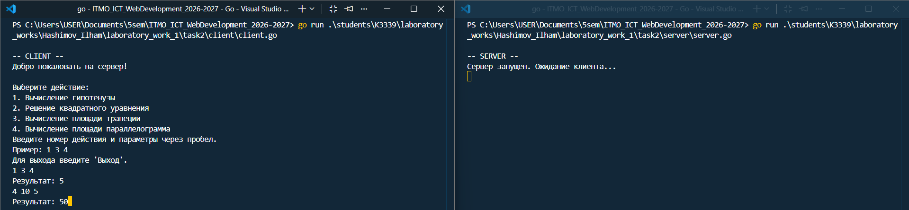
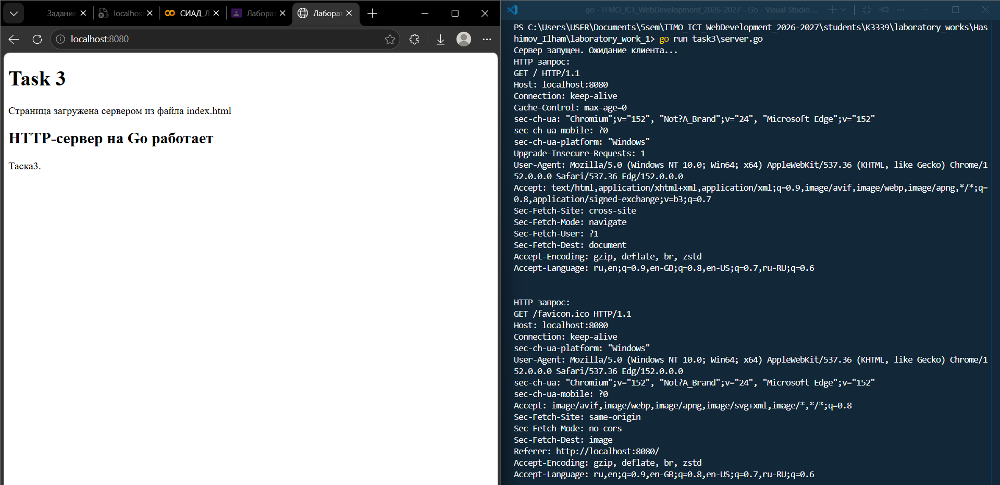
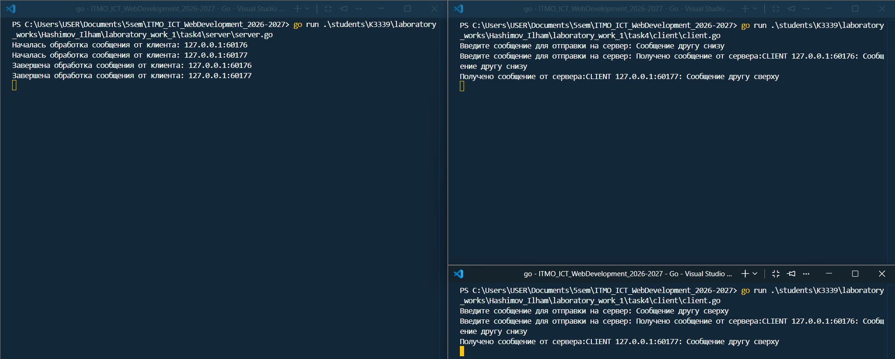
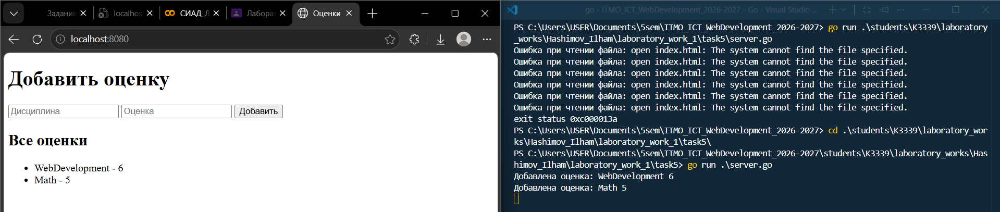

# Лабораторная работа №1

## Task 1. UDP клиент и сервер

В первой задаче реализован простой обмен сообщениями по UDP.

### Сервер

Сначала создаётся UDP-адрес и сервер начинает слушать `localhost:8080`:

```go
addr, err := net.ResolveUDPAddr("udp", "localhost:8080")
conn, err := net.ListenUDP("udp", addr)
```

`ResolveUDPAddr` меняет строку адреса в `UDPAddr`, а `ListenUDP` создаёт UDP-сокет сервера.

Далее сервер ждёт сообщение от клиента:

```go
buffer := make([]byte, 1024)
n, clientAddr, err := conn.ReadFromUDP(buffer)
```

`ReadFromUDP` возвращает количество полученных байтов и адрес клиента, который отправил сообщение.

После получения сервер выводит сообщение и отправляет ответ обратно этому же клиенту:

```go
fmt.Println("Получено сообщение от клиента:", string(buffer[:n]), "от", clientAddr)

_, err = conn.WriteToUDP([]byte("Hello, client!"), clientAddr)
```

### Клиент

Клиент также получает адрес сервера:

```go
addr, err := net.ResolveUDPAddr("udp", "localhost:8080")
conn, err := net.DialUDP("udp", nil, addr)
```

`DialUDP` создаёт UDP-соединение с указанным сервером.

Сообщение отправляется через `Write`:

```go
_, err = conn.Write([]byte("Hello, server!"))
```

После этого клиент ждёт ответ:

```go
buffer := make([]byte, 1024)
n, err := conn.Read(buffer)
```

И выводит только реально полученные байты:

```go
fmt.Println("Получено сообщение от сервера:", string(buffer[:n]))
```

### Скриншот



---

## Task 2. TCP сервер с вычислениями

Во второй задаче используется TCP. Клиент выбирает математическую операцию и отправляет параметры серверу.

### Подключение сервера

Сервер создаёт TCP-адрес и начинает слушать порт:

```go
addr, err := net.ResolveTCPAddr("tcp", "localhost:8080")
listener, err := net.ListenTCP("tcp", addr)
```

`ListenTCP` создаёт серверного TCP-слушателя.

После этого сервер принимает соединение клиента:

```go
clientConn, err := listener.AcceptTCP()
defer clientConn.Close()
```

`AcceptTCP` ждёт нового подключения и возвращает отдельное соединение с конкретным клиентом.

### Подключение клиента

Клиент подключается к серверу через:

```go
addr, err := net.ResolveTCPAddr("tcp", "localhost:8080")
conn, err := net.DialTCP("tcp", nil, addr)
```

`DialTCP` устанавливает TCP-соединение с сервером.

### Отправка операции

Клиент получает номер операции и параметры из консоли. Например для операций с двумя аргументами:

```go
fmt.Scan(&a, &b)
message = fmt.Sprintf("%s %v %v", operation, a, b)
```

После этого строка отправляется серверу:

```go
_, err = conn.Write([]byte(message))
```

На сервере сообщение преобразуется в строку и разбивается по пробелам:

```go
message := strings.TrimSpace(string(buf[:n]))
parts := strings.Fields(message)
```

Например строка:

```text
1 3 4
```

после `strings.Fields` превращается в:

```text
["1", "3", "4"]
```

### Вычисления

Для параметров из строк в числа используется:

```go
value, err := strconv.ParseFloat(param, 64)
```

После этого в зависимости от выбранной операции вызывается нужная функция.

Например вычисление гипотенузы:

```go
func Pythagoras(a, b float64) float64 {
    return math.Sqrt((a * a) + (b * b))
}
```

Также реализованы:

```go
quadraticEquation(...)
areaOfTrapezoid(...)
areaOfParallelogram(...)
```

Выбор выполняется через `switch` внутри `programCalculation`.

Результат снова переводится в строку и отправляется клиенту:

```go
Result = fmt.Sprintf("Результат: %v", outResult)
clientConn.Write([]byte(Result))
```

### Скриншот



---

## Task 3. HTTP-сервер

В третьей задаче сервер получает обычный HTTP-запрос от браузера и вручную формирует HTTP-ответ.

### Запуск сервера

Используется обычный TCP-listener:

```go
addr, err := net.ResolveTCPAddr("tcp", "localhost:8080")
listener, err := net.ListenTCP("tcp", addr)
```

Сервер постоянно принимает новые подключения:

```go
for {
    clientConn, err := listener.AcceptTCP()
    handleClient(clientConn)
}
```

### Чтение HTTP-запроса

В `handleClient` запрос браузера читается обычным `Read`:

```go
buffer := make([]byte, 1024)
n, err := conn.Read(buffer)
```

После этого запрос можно вывести:

```go
fmt.Println("HTTP запрос:")
fmt.Println(string(buffer[:n]))
```

В терминале будет видно примерно:

```text
GET / HTTP/1.1
Host: localhost:8080
...
```

### Чтение HTML-файла

HTML в отдельнОм `index.html`:

```go
html, err := os.ReadFile("task3/index.html")
```

`os.ReadFile` читает содержимое файла и возвращает его как `[]byte`.

### Формирование HTTP-ответа

Ответ собирается вручную:

```go
response := "HTTP/1.1 200 OK\r\n" +
    "Content-Type: text/html\r\n" +
    "Content-Length: " + fmt.Sprint(len(html)) + "\r\n"
```

После заголовков обязательно идёт пустая строка:

```go
response += "\r\n" + string(html)
```

`\r\n\r\n` отделяет HTTP-заголовки от HTML-тела.

Готовый ответ отправляется браузеру:

```go
_, err = conn.Write([]byte(response))
```

### Скриншот



---

## Task 4. Многопользовательский TCP-чат

В этой задаче один сервер обслуживает несколько клиентов одновременно.

### Хранение клиентов

Все подключения сохраняются в срез:

```go
var clients []*net.TCPConn
```

После подключения нового клиента он добавляется в этот срез:

```go
clients = append(clients, clientConn)
```

### Одновременная работа с несколькими клиентами

Для каждого клиента запускается отдельная goroutine:

```go
go handleClient(clientConn)
```

Goroutine в Go дает выполнять обработку клиентов независимо друг от друга.  
По смыслу здесь она заменяет отдельный поток обработки клиента, который часто используюь в Python.

### Mutex

Несколько goroutine могут одновременно изменять `clients`, поэтому используется:

```go
var mutex sync.Mutex
```

При изменении среза доступ временно блокируется:

```go
mutex.Lock()
clients = append(clients, clientConn)
mutex.Unlock()
```

Это нужно, чтобы несколько goroutine не меняли общий срез одновременно.

### Получение и рассылка сообщения

Сервер читает сообщение клиента:

```go
n, err := clientConn.Read(buffer)
```

К сообщению добавляется адрес отправителя:

```go
message := fmt.Sprintf(
    "CLIENT %s: %s",
    clientConn.RemoteAddr(),
    string(buffer[:n]),
)
```

После этого вызывается:

```go
broadcastMessage(message)
```

Внутри функция проходит по всем клиентам:

```go
for _, client := range clients {
    client.Write([]byte(message))
}
```

Таким образом одно сообщение отправляется всем подключённым клиентам.

### Демонстрация одновременной обработки

В сервер добавлена задержка:

```go
time.Sleep(10 * time.Second)
```

Она нужна только для демонстрации. Если два клиента отправят сообщения почти одновременно, в терминале будет видно, что обработка обоих сообщений уже началась до завершения первого.

### Удаление клиента

При завершении соединения выполняется:

```go
defer removeClient(clientConn)
```

Внутри нужный элемент удаляется из среза:

```go
clients = append(clients[:i], clients[i+1:]...)
```

### Клиент чата

Получение сообщений запускается отдельно:

```go
go receiveMessages(conn)
```

А отправка остаётся в основной goroutine:

```go
sendMessages(conn)
```

Так клиент может одновременно ждать сообщения от сервера и вводить свои.

Для ввода полной строки используется:

```go
scanner := bufio.NewScanner(os.Stdin)
scanner.Scan()
message := scanner.Text()
```

Перед отправкой добавляется `\n`:

```go
conn.Write([]byte(message + "\n"))
```

А получатель читает данные до `\n`:

```go
reader := bufio.NewReader(conn)
message, err := reader.ReadString('\n')
```

Это нужно, потому что TCP передаёт поток байтов и сам не хранит границы отдельных сообщений.

### Скриншот


---

## Task 5. GET и POST запросы

В пятой задаче реализован простой веб-сервер. Он принимает дисциплину и оценку через POST, а через GET показывает сохранённые оценки.


Здесь используется более короткий вариант:

```go
listener, err := net.Listen("tcp", "localhost:8080")
```

Подключение принимается так:

```go
conn, err := listener.Accept()
handleClient(conn)
```

### Определение GET или POST

Запрос читается:

```go
n, err := conn.Read(buf)
request := string(buf[:n])
```

Далее начало запроса разбивается:

```go
parts := strings.Fields(request)
method := strings.ToUpper(parts[0])
path := parts[1]
```

Для запроса:

```text
GET / HTTP/1.1
```

получается:

```text
method = GET
path = /
```

После этого вызывается нужный обработчик:

```go
if method == "GET" {
    handleGet(conn, path)
} else if method == "POST" {
    handlePost(conn, path, request)
}
```

### Хранение оценок

Одна запись представлена структурой:

```go
type Grade struct {
    Subject string
    Grade   string
}
```

Все записи хранятся в срезе:

```go
var grades []Grade
```

### POST

Тело HTTP-запроса находится после пустой строки. Поэтому запрос делится по:

```go
parts := strings.Split(request, "\r\n\r\n")
body := parts[1]
```

Форма отправляет данные примерно так:

```text
subject=Math&grade=5
```

Сначала разделяем разные поля:

```go
fields := strings.Split(body, "&")
```

Получается:

```text
subject=Math
grade=5
```

Затем каждое поле разделяется по `=`:

```go
pair := strings.Split(field, "=")
```

После этого через `switch` значения записываются в переменные:

```go
switch pair[0] {
case "subject":
    subject = pair[1]
case "grade":
    grade = pair[1]
}
```

Новая запись добавляется:

```go
grades = append(grades, Grade{
    Subject: subject,
    Grade:   grade,
})
```

После сохранения снова вызывается `handleGet`, чтобы сразу показать обновлённую страницу:

```go
handleGet(conn, "/")
```

### GET

HTML хранится отдельно в `index.html`:

```go
html, err := os.ReadFile("index.html")
```

В файле есть место:

```html
{{GRADES}}
```

Из сохранённых оценок создаются элементы списка:

```go
for _, grade := range grades {
    gradesHTML += "<li>" + grade.Subject + " - " + grade.Grade + "</li>"
}
```

После этого `{{GRADES}}` заменяется готовым HTML:

```go
htmlString := strings.Replace(
    string(html),
    "{{GRADES}}",
    gradesHTML,
    1,
)
```

Дальше формируется обычный HTTP-ответ:

```go
response := "HTTP/1.1 200 OK\r\n" +
    "Content-Type: text/html; charset=utf-8\r\n" +
    "Content-Length: " + strconv.Itoa(len(htmlString)) + "\r\n"
```

И добавляется тело:

```go
response += "\r\n" + htmlString
```

После этого страница отправляется браузеру:

```go
conn.Write([]byte(response))
```

### Скриншоты



-