# Лабораторная работа №2

## Доска домашних заданий

Во второй работе реализован сайт для хранения домашних заданий, пользователей и сдач. Работа на Go.

---

## Практика 2.1. Проект, модели и первые страницы

### Task 1. Создание и запуск проекта

Проект находится в `laboratory_work_2`. Его основные файлы:

```text
laboratory_work_2/
├── cmd/server/main.go
├── internal/
│   ├── app/
│   │   ├── models.go
│   │   ├── repository.go
│   │   ├── repository_postgres.go
│   │   ├── views.go
│   │   ├── urls.go
│   │   ├── admin.go
│   │   └── auth.go
│   └── database/postgres.go
├── migrations/
│   ├── 001_init.up.sql
│   ├── 001_init.down.sql
│   ├── 002_extend_users.up.sql
│   └── 002_extend_users.down.sql
├── web/templates/
├── go.mod
└── go.sum
```


Перед запуском нужна PostgreSQL с миграциями и локальный файл `.env`. Пример его формата значениями:

```dotenv
DATABASE_DSN="host=localhost user=lab_user password=d_password dbname=lab2 port=5432 sslmode=disable"
```

В `main.go` конфигурация читается так:

```go
err := godotenv.Load()
dsn := os.Getenv("DATABASE_DSN")
db, err := database.NewPostgres(dsn)
```

В текущем коде ошибка загрузки `.env` останавливает запуск. Значит, файл должен существовать даже при использовании переменных окружения.

Подключение создаётся в `internal/database/postgres.go`:

```go
dialector := postgres.Open(dsn)
db, err := gorm.Open(dialector, &gorm.Config{})
sqlDB, err := db.DB()
err = sqlDB.Ping()
```

`gorm.Open` создаёт объект ORM. Через `db.DB()` получается нижележащий `*sql.DB`, чтобы проверить доступность PostgreSQL методом `Ping`.

После этого создаются репозитории, обработчики и маршрутизатор. Сервер слушает `127.0.0.1:8080`; список заданий открывается по адресу `http://127.0.0.1:8080/homeworks`. Для `/` отдельного маршрута нет.

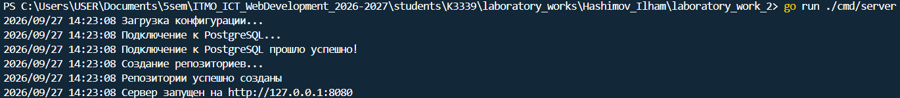

Общий путь запроса:

```text
Браузер → ServeMux → обработчик → репозиторий → PostgreSQL
                          ↓
                    html/template → HTML в браузер
```

### Task 2.1. Модель данных

В `internal/app/models.go` описаны три структуры: `User`, `Homework` и `Submission`.

| Модель | Основные поля | Для чего используется |
| --- | --- | --- |
| `User` | `ID`, `Username`, `PasswordHash`, `IsAdmin`, `ClassName` | Пользователь и его роль |
| `Homework` | `TeacherID`, `Subject`, `Text`, `Penalty`, даты | Домашнее задание |
| `Submission` | `StudentID`, `HomeworkID`, `Text`, `SubmittedAt`, `Grade` | Сдача конкретного задания |

Например, домашнее задание описано так:

```go
type Homework struct {
    ID        int64
    TeacherID int64
    Subject   string
    Text      string
    Penalty   string
    IssueDate time.Time
    StartDate time.Time
    EndDate   time.Time
}
```

`struct` в данном случае играет роль модели с полями.

По соглашениям GORM структура `Homework` соответствует таблице `homeworks`, а поле `TeacherID` колонке `teacher_id`. Структуры описывают данные в программе.

Связи имеют вид:

```text
users.id ──< homeworks.teacher_id
users.id ──< submissions.student_id
homeworks.id ──< submissions.homework_id
```

Один пользователь может быть указан преподавателем у нескольких заданий. У задания может быть несколько сдач, а пользователь может сдавать разные задания.

В `Submission` оценка объявлена как указатель:

```go
Grade *float64
```

`nil` означает, что оценки пока нет. Это отличается от оценки `0`; в PostgreSQL отсутствие оценки хранится как `NULL`.

### Task 2.2. Миграции

Первая миграция `001_init.up.sql` создаёт таблицы `users`, `homeworks` и `submissions`. Например:

```sql
CREATE TABLE submissions (
    id BIGSERIAL PRIMARY KEY,
    student_id BIGINT NOT NULL,
    homework_id BIGINT NOT NULL,
    text TEXT NOT NULL,
    submitted_at TIMESTAMP NOT NULL,
    grade DOUBLE PRECISION,

    FOREIGN KEY (student_id) REFERENCES users(id),
    FOREIGN KEY (homework_id) REFERENCES homeworks(id)
);
```

В отличие от `makemigrations`, SQL здесь написан вручную. В приложении нет `AutoMigrate` и автоматического запуска этих файлов. Для новой базы последовательно применяются `001_init.up.sql`, затем `002_extend_users.up.sql` через используемый SQL-клиент или инструмент миграций.


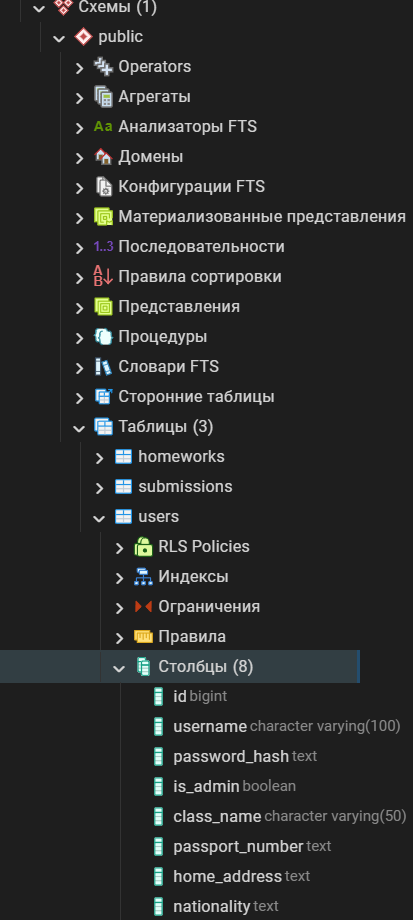

### Репозиторий и запросы к БД

Обработчики обращаются к интерфейсу репозитория. Например:

```go
type UserRepository interface {
    Create(ctx context.Context, user User) (int64, error)
    GetByID(ctx context.Context, id int64) (User, error)
    GetByUsername(ctx context.Context, username string) (User, error)
    GetAll(ctx context.Context) ([]User, error)
}
```

Интерфейс перечисляет доступные операции. Реализация с PostgreSQL хранит `*gorm.DB` и выполняет запросы:

```go
result := r.db.WithContext(ctx).Create(&user)
result := r.db.WithContext(ctx).First(&user, id)
result := r.db.WithContext(ctx).Find(&users)
```

Знак `&` передаёт адрес переменной, чтобы GORM мог заполнить её данными. Вместо исключения запрос возвращает ошибку в `result.Error`. `r.Context()` передаёт контекст текущего HTTP-запроса в запрос к БД.

### Task 3. Панель администратора

Панель находится по адресу `/admin`. В ней есть списки и формы создания пользователей, домашних заданий и сдач.

В Django эти страницы предоставляет встроенная админка. Здесь они написаны в `admin.go`, поэтому каждая операция подключается отдельным маршрутом и шаблоном.

Например, список пользователей получает данные и передаёт их в шаблон:

```go
users, err := v.userRepo.GetAll(r.Context())
tmpl, err := template.ParseFiles("web/templates/admin/users.html")
err = tmpl.Execute(w, users)
```

Первый администратор должен уже находиться в БД. Отдельной команды `createsuperuser` нет.

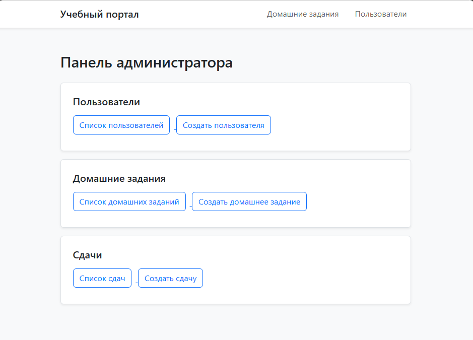

### Task 4. Страница объекта по ID

В `HomeworkView.Detail` идентификатор берётся из адреса:

```go
idStr := r.PathValue("id")
id, err := strconv.ParseInt(idStr, 10, 64)
homework, err := v.repo.GetByID(r.Context(), id)
```

Для `/homework/1` строка `idStr` равна `"1"`. `ParseInt` переводит её в `int64`. Если ID некорректный, возвращается HTTP 400; если запись не найдена 404.

В шаблон передаётся структура с заданием и текущим пользователем:

```go
data := HomeworkPageData{
    Homework: homework,
    User:     user,
    IsLogged: isLogged,
}
err = tmpl.Execute(w, data)
```

В HTML к этим данным обращаются так:

```html
<h1>{{ .Homework.Subject }}</h1>
<p><b>Описание:</b> {{ .Homework.Text }}</p>
```

Точка это переданные в `Execute` данные. `html/template` подставляет значения и экранирует обычный текст с учётом HTML-контекста. Это Go-шаблонизатор.

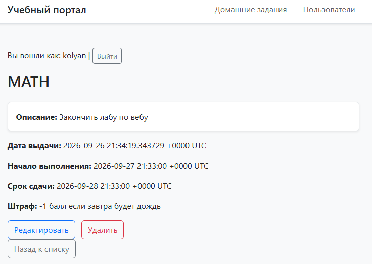

### Task 5. Маршруты

В `urls.go` адрес связывается с обработчиком:

```go
mux := http.NewServeMux()
mux.HandleFunc("GET /homework/{id}", homeworkView.Detail)
mux.HandleFunc("GET /homeworks", homeworkView.List)
```

В шаблоне маршрута указаны HTTP-метод и параметр `{id}`, который затем читается через `r.PathValue`.

Маршрутизатор передаётся в `http.Serve(listener, router)` в `main.go`. общий маршрутизатор создаётся функцией `NewRouter`.

---

## Практика 2.2. Связи, списки и CRUD

### Task 1. Промежуточная модель

`Submission` связывает пользователя и домашнее задание. У этой связи есть собственные данные: текст ответа, время сдачи и оценка.

```go
type Submission struct {
    ID          int64
    StudentID   int64
    HomeworkID  int64
    Text        string
    SubmittedAt time.Time
    Grade       *float64
}
```

По назначению это соответствует промежуточной модели `through` из Django: связь хранится в отдельной таблице вместе со своими полями. В Go-проекте внешние ключи заданы в SQL, а не через `ManyToManyField` или ассоциации GORM.


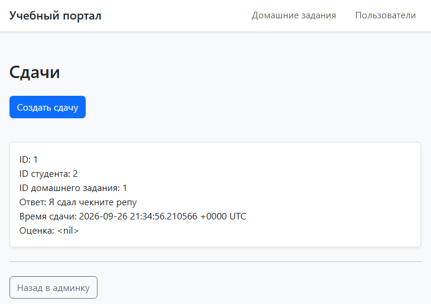

### Task 2. Список пользователей и заданий

Вывод списка пользователей устроен так же, как список в админке: `GetAll → ParseFiles → Execute`. Отличаются шаблон `web/templates/users.html` и адрес `/users`.

В шаблоне список перебирается через `range`:

```html
{{ range . }}
    <p>
        ID: {{ .ID }}<br>
        Username: {{ .Username }}<br>
        Класс: {{ .ClassName }}
    </p>
{{ end }}
```

Внутри `range` точка означает текущего пользователя, а не весь список.

У заданий есть список `/homeworks` и отдельная страница `/homework/{id}`. В списке используются пагинация и фильтрация они разобраны ниже, поэтому второй раз весь обработчик не приводится.

### Обработчик-метод и CBV

В методичке отдельно рассматриваются FBV и CBV. В Go HTTP-обработчик принимает `http.ResponseWriter` и `*http.Request`. `ResponseWriter` нужен для ответа клиенту, `Request` содержит запрос.

Обработчики проекта оформлены методами структур:

```go
type HomeworkView struct {
    repo HomeworkRepository
    auth *Auth
}

func (v *HomeworkView) Detail(w http.ResponseWriter, r *http.Request) {
    // Получение задания и вывод шаблона.
}
```

`(v *HomeworkView)` он получатель метода. Через него обработчик получает доступ к репозиторию и авторизации. Это позволяет собрать связанные действия в одном типе. чтение запроса, проверки и сохранение написаны явно.

Методы `UserView.List` и `UserView.Create` тоже имеют получателя. Поэтому отдельной реализации списка и создания пользователя как свободных функций, буквально соответствующей требованию FBV, в текущем коде нет.

### Task 3. Создание пользователя

Один адрес обслуживает два действия:

```go
mux.HandleFunc("GET /users/create", userView.Create)
mux.HandleFunc("POST /users/create", userView.Create)
```

При `GET` показывается форма, при `POST` читаются значения и создаётся запись:

```go
err := r.ParseForm()
username := r.FormValue("username")
password := r.FormValue("password")
className := r.FormValue("class_name")
```

Значение `name` у HTML-поля должно совпадать с аргументом `FormValue`.

Обычная форма задаёт `IsAdmin: false`. В админ форме дополнительно читается флажок:

```go
isAdmin := r.FormValue("is_admin") == "on"
```

Доступ к админ форме проверяется на сервере. Остальные поля сохраняются тем же методом `UserRepository.Create`; повторять его реализацию для админки не нужно.

### Создание домашнего задания

Администратор открывает `/homeworks/create`. Форма передаёт предмет, ID преподавателя, даты, описание и штраф.

Число и даты преобразуются из строк:

```go
teacherID, err := strconv.ParseInt(teacherIDStr, 10, 64)
startDate, err := time.Parse("2006-01-02T15:04", startDateStr)
endDate, err := time.Parse("2006-01-02T15:04", endDateStr)
```

В Go формат даты записывается через специальную дату `2006-01-02T15:04`


Дата публикации задаётся через `time.Now()`. Запись сохраняется методом `Create`, после чего сервер перенаправляет браузер на список:

```go
http.Redirect(w, r, "/homeworks", http.StatusSeeOther)
```

`StatusSeeOther` ответ 303. Браузер после POST выполняет GET списка, поэтому обновление открывшейся страницы не повторяет отправку формы.
Ниже видно так же что работет пагинация.

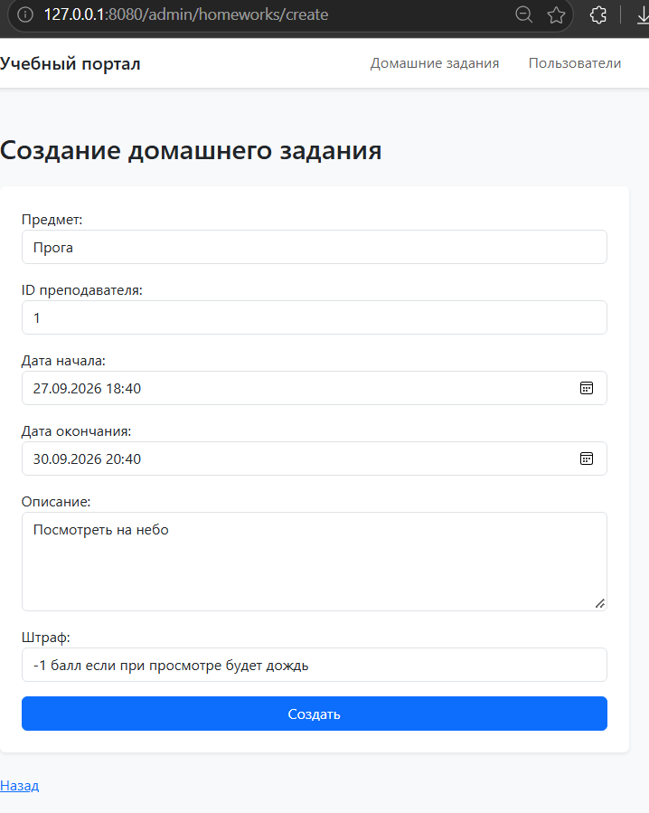
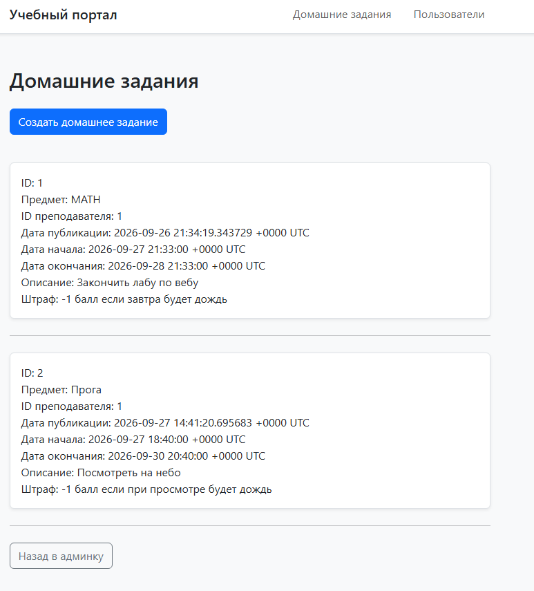
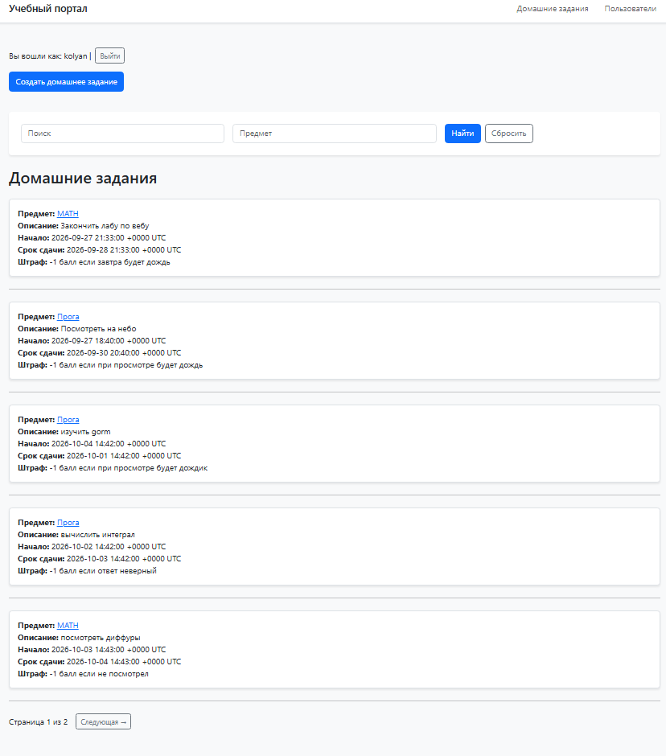

### Обновление домашнего задания

`/homework/{id}/update` сначала получает существующее задание. При GET его значения подставляются в форму:

```html
<input type="text" name="subject" value="{{ .Subject }}">
<input type="datetime-local" name="start_date" value="{{ .StartDate.Format "2006-01-02T15:04" }}">
```

При POST поля читаются так же, как при создании. Отличается сохранение: изменяется уже найденная структура с её ID, затем вызывается `v.repo.Update`. В репозитории используется:

```go
result := r.db.WithContext(ctx).Save(&homework)
```

После сохранения браузер возвращается на карточку задания. Код чтения полей здесь такой же, поэтому повторно его не привожу.

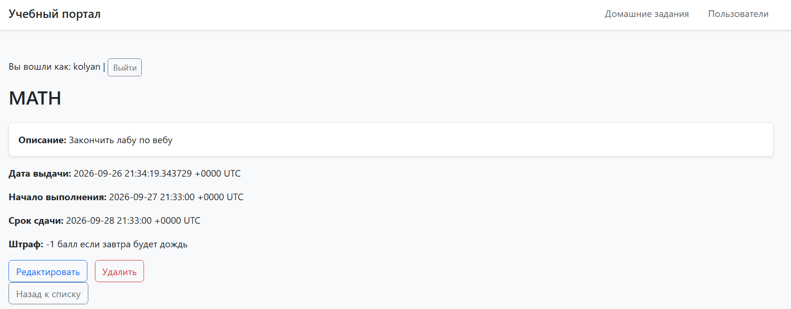
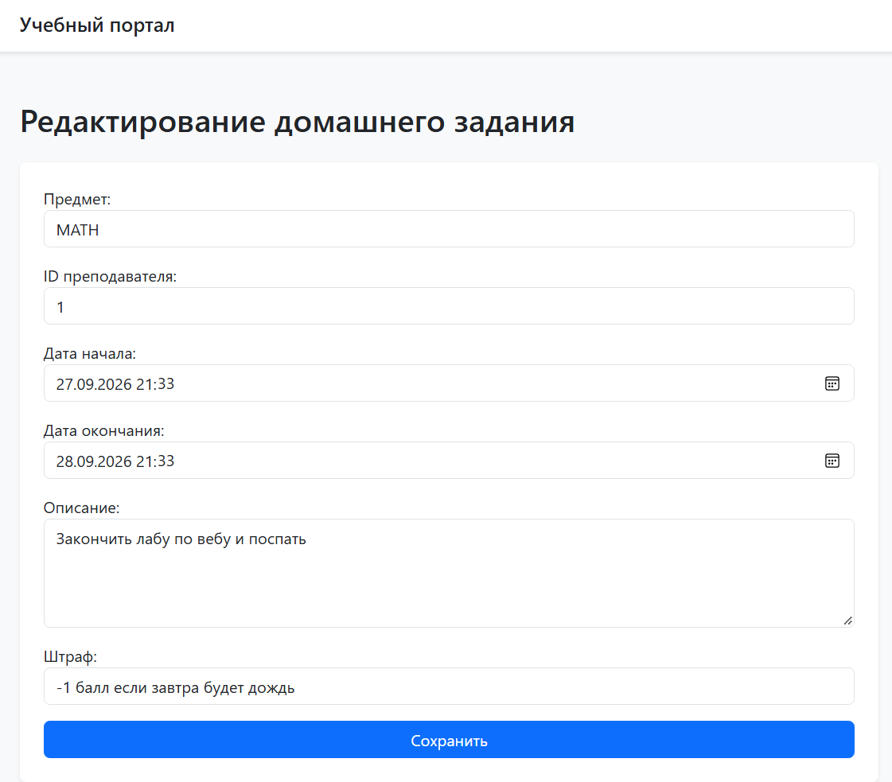
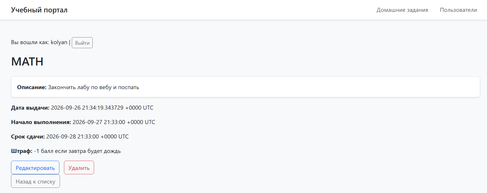

### Удаление домашнего задания

При GET `/homework/{id}/delete` показывается подтверждение. Само удаление выполняется только после отправки формы POST:

```go
err = v.repo.Delete(r.Context(), id)
http.Redirect(w, r, "/homeworks", http.StatusSeeOther)
```

В репозитории вызывается `Delete(&Homework{}, id)`. После этого показывается список.

пробуем удалить задание, которое кто-то сдал
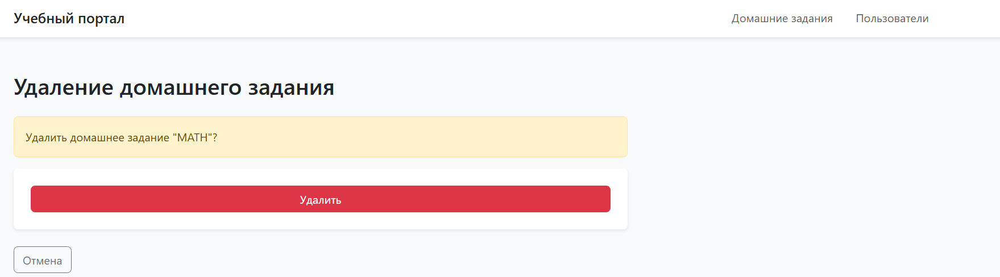
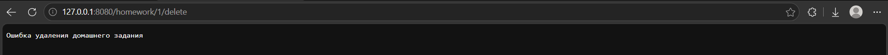

теперь пробуем удалить задание, которое никто не сдал
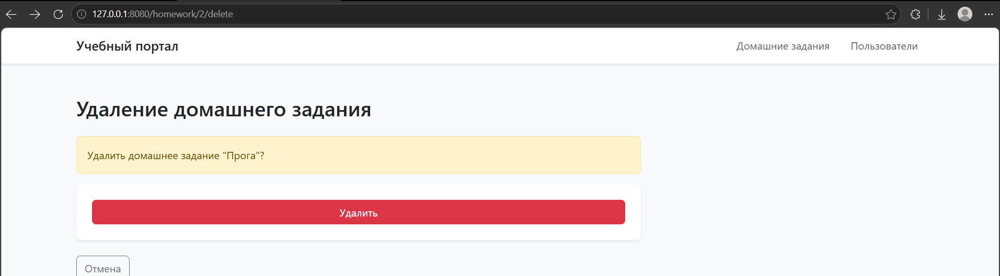
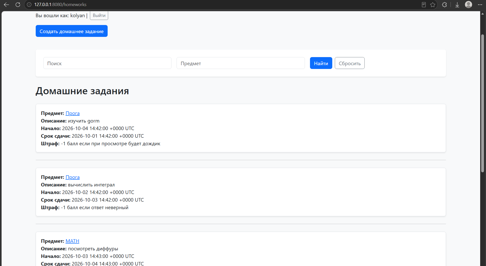


Создание сдачи имеет вид

```go
submission := Submission{
    StudentID:   studentID,
    HomeworkID:  homeworkID,
    Text:        text,
    SubmittedAt: time.Now(),
    Grade:       nil,
}
```

Время сдачи задаётся сервером, оценка при создании отсутствует. Сейчас форма доступна администратору по `/admin/submissions/create`.

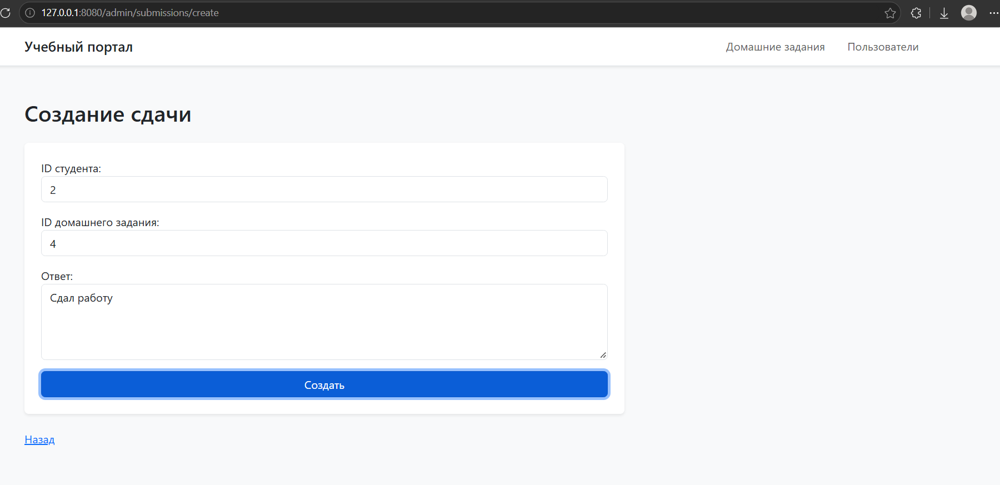
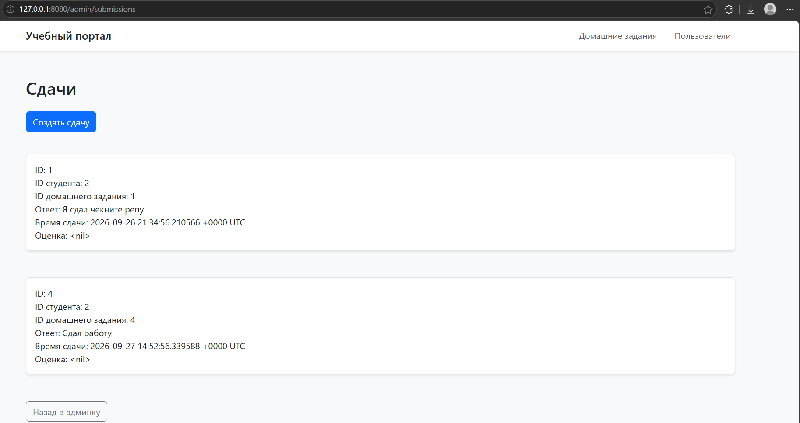

---

## Практика 2.3. Расширение пользователя

В этой практике нужно добавить номер паспорта, домашний адрес и национальность, вывести их в админке и реализовать форму создания пользователя с новыми атрибутами.

### Новые поля модели

В структуру `User` добавлены:

```go
PassportNumber string
HomeAddress    string
Nationality    string
```

В Django для этого в методичке предлагается наследование от `AbstractUser`. Здесь модель пользователя изначально своя, поэтому поля добавляются в структуру.

### Изменение таблицы

Миграция `002_extend_users.up.sql` дополняет существующую таблицу:

```sql
ALTER TABLE users
ADD COLUMN passport_number TEXT,
ADD COLUMN home_address TEXT,
ADD COLUMN nationality TEXT;
```

### Чтение новых полей из формы

В `UserView.Create` и `AdminView.CreateUser` добавлены одинаковые строки:

```go
passportNumber := r.FormValue("passport_number")
homeAddress := r.FormValue("home_address")
nationality := r.FormValue("nationality")
```

Затем значения попадают в создаваемого пользователя:

```go
PassportNumber: passportNumber,
HomeAddress:    homeAddress,
Nationality:    nationality,
```

### Вывод пользователя

В обычном списке `/users` и в `/admin/users` добавлены выражения:

```html
Номер паспорта: {{ .PassportNumber }}<br>
Домашний адрес: {{ .HomeAddress }}<br>
Национальность: {{ .Nationality }}
```

Обычная форма находится по `/users/create`, административная  по `/admin/users/create`. Обе передают три дополнительных поля. В административной форме также можно задать `is_admin`.

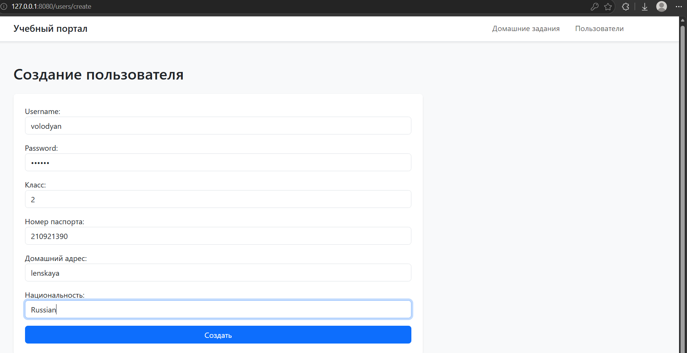
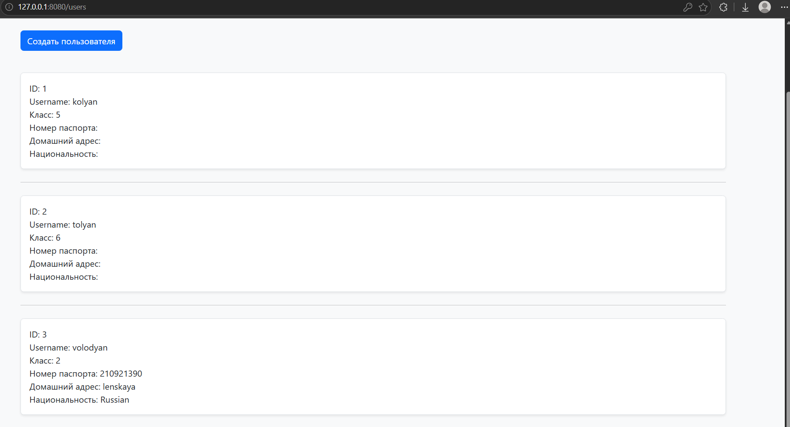
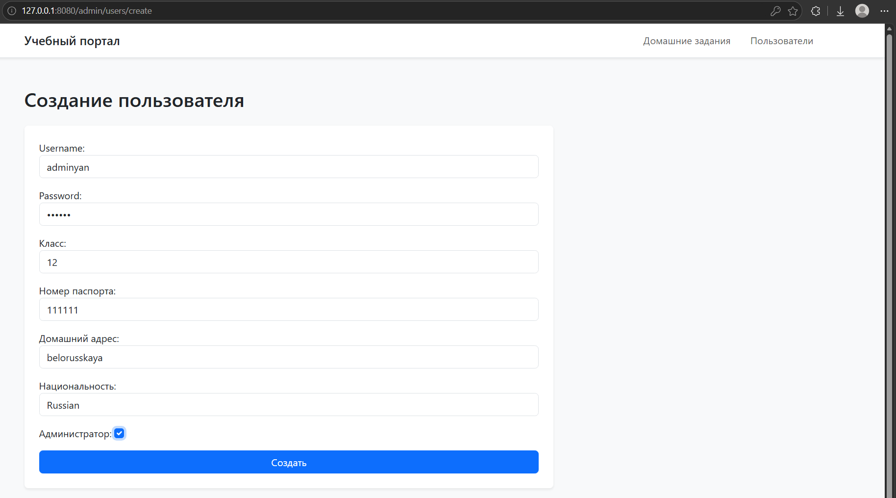
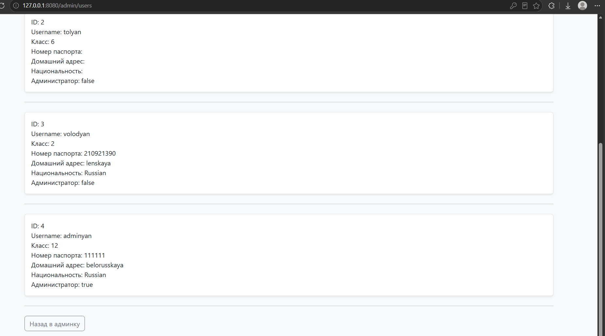

---

## Авторизация и разделение прав

### Вход и сессия

GET `/login` показывает форму. POST читает `username` и `password`, ищет пользователя и проверяет пароль.

После успешной проверки создаётся идентификатор сессии:

```go
bytes := make([]byte, 32)
_, err := rand.Read(bytes)
sessionID := hex.EncodeToString(bytes)
```

В памяти сервера хранится соответствие:

```go
sessions map[string]int64
```

Ключ 
 случайный идентификатор сессии, значение ID пользователя. это напоминает словарь Python. Доступ к общей `map` защищён `sync.RWMutex`, потому что HTTP-запросы могут обрабатываться одновременно.

Браузеру отправляется cookie:

```go
http.SetCookie(w, &http.Cookie{
    Name:     "session_id",
    Value:    sessionID,
    Path:     "/",
    HttpOnly: true,
    SameSite: http.SameSiteLaxMode,
})
```

В следующих запросах браузер передаёт cookie обратно. `CurrentUser` находит сессию, получает ID и загружает пользователя из БД. После перезапуска сервера карта сессий пустая, поэтому потребуется новый вход.

Несмотря на имя `PasswordHash`, текущая версия сохраняет пароль без хэширования и сравнивает строки.

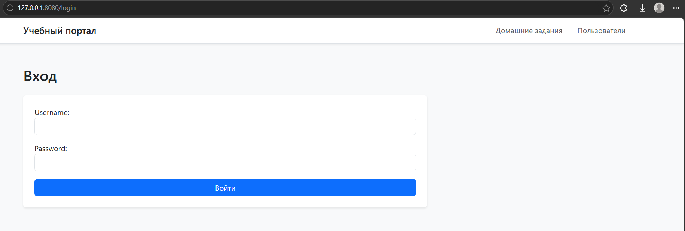
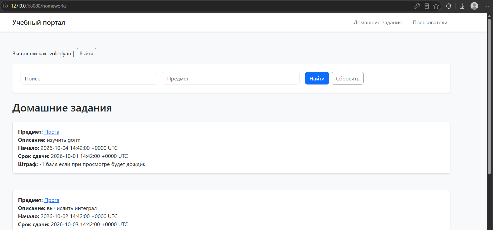

### Проверка на сервере

Изменение заданий и административные страницы подключены через `RequireAdmin`:

```go
mux.HandleFunc("POST /homeworks/create", auth.RequireAdmin(homeworkView.Create))
```

`RequireAdmin` возвращает новый обработчик, который сначала проверяет сессию и роль.

```go
if !user.IsAdmin {
    http.Error(w, "Доступ запрещен", http.StatusForbidden)
    return
}
next(w, r)
```

Если сессии нет, браузер перенаправляется на `/login`. Если пользователь вошёл, но не является администратором, возвращается 403. Только после проверки вызывается исходный обработчик.

### Проверка в шаблоне

Кнопки редактирования и удаления показываются по условию:

```html
{{ if .User.IsAdmin }}
    <a href="/homework/{{ .Homework.ID }}/update">Редактировать</a>
    <a href="/homework/{{ .Homework.ID }}/delete">Удалить</a>
{{ end }}
```

В списке аналогично показывается кнопка создания. Это выполняет клиентскую часть разграничения прав из задания. При этом ручной переход по адресу дополнительно защищён серверным обработчиком.

Выход удаляет сессию из `map`, отправляет cookie с `MaxAge: -1` и перенаправляет на `/login`.

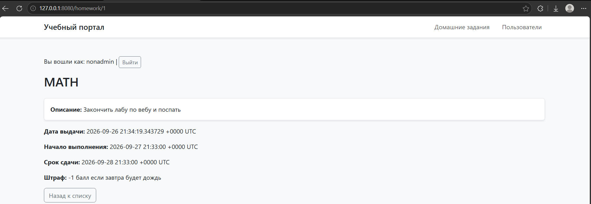
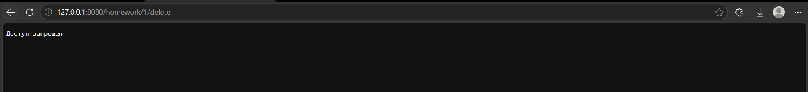
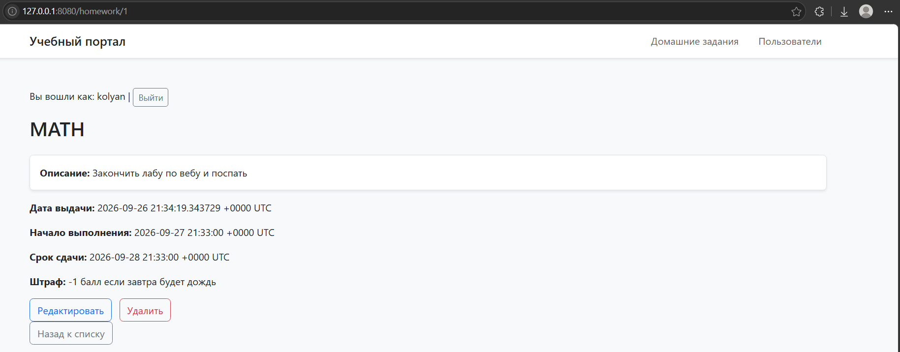

---

## Пагинация, поиск и фильтрация

### Пагинация

В `HomeworkView.List` на одной странице показывается до пяти заданий:

```go
const limit = 5
pageStr := r.URL.Query().Get("page")
```

Если `page` не передан, некорректен или меньше единицы, используется первая страница. Количество страниц и смещение вычисляются так:

```go
totalPages := int((count + int64(limit) - 1) / int64(limit))
offset := (page - 1) * limit
```

Например, для 12 записей получаются три страницы. На второй странице `offset = 5`: первые пять записей пропускаются. Если результатов нет, код оставляет одну пустую страницу. Если запрошенная страница больше последней, используется последняя.

В GORM применяются:

```go
query.Limit(limit).Offset(offset).Find(&homeworks)
```

В шаблон также передаются `HasPrev`, `HasNext`, `PrevPage`, `NextPage`, `Page` и `TotalPages`. По ним показываются ссылки «Предыдущая» и «Следующая».

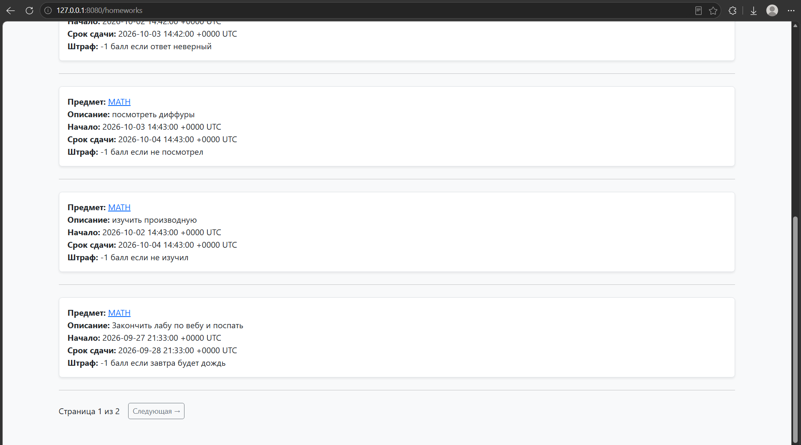
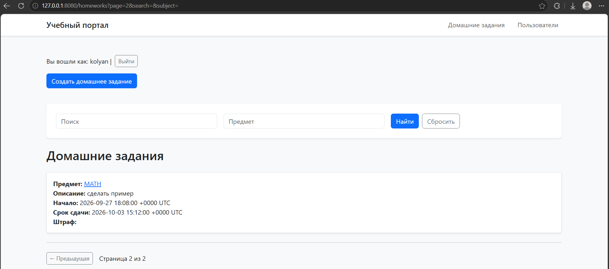

### Поиск и фильтр

Параметры читаются из URL:

```go
search := r.URL.Query().Get("search")
subject := r.URL.Query().Get("subject")
```

Поиск проверяет предмет и текст задания:

```go
searchValue := "%" + search + "%"
query = query.Where(
    "subject ILIKE ? OR text ILIKE ?",
    searchValue,
    searchValue,
)
```

`ILIKE` в PostgreSQL выполняет сравнение без учёта регистра. Знаки `%` ищет подтекст строки. Значения передаются параметрами на места `?`.

Фильтр по предмету использует точное совпадение:

```go
query = query.Where("subject = ?", subject)
```

Примеры адресов:

```text
/homeworks?search=интеграл
/homeworks?subject=Математика
/homeworks?search=интеграл&subject=Математика&page=2
```

Методы `CountFiltered` и `GetPageFiltered` используют одинаковые условия. Первый считает подходящие записи, второй возвращает только нужную страницу. Это нужно, чтобы число страниц совпадало с результатом фильтрации.

### Сохранение параметров при переходе

В ссылку следующей страницы включены оба поля фильтра:

```html
<a href="/homeworks?page={{ .NextPage }}&search={{ .Search }}&subject={{ .Subject }}">
    Следующая →
</a>
```

Поэтому переход не сбрасывает поиск. Кнопка Сбросить ведёт на `/homeworks` без параметров.
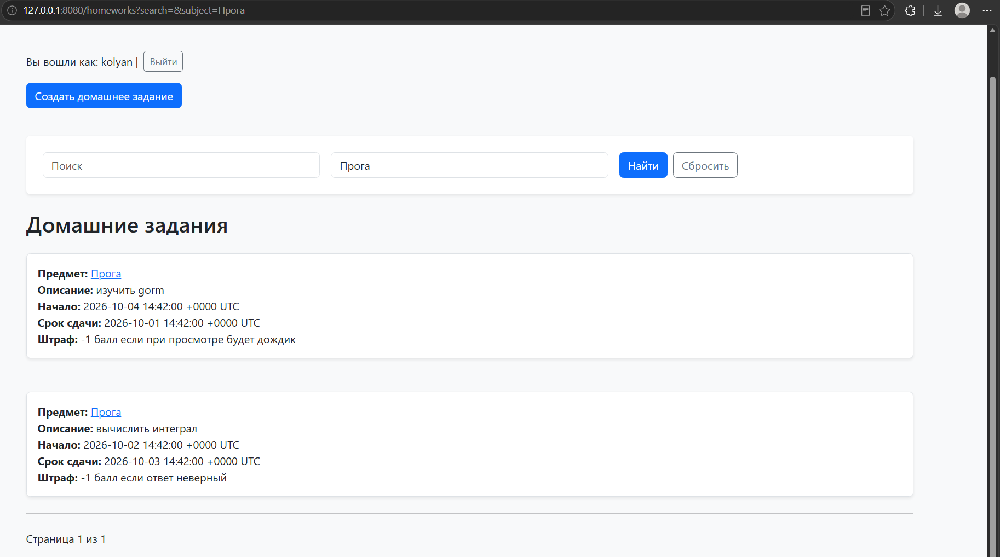

---

## Оформление и реализованные интерфейсы

В каждый HTML-шаблон подключён Bootstrap 5.3.8 через CDN.

Ниже перечислены все страницы. В колонке «Доступ» указан доступ по текущим маршрутам, а не только наличие ссылки в меню.

| Адрес | Шаблон в `web/templates/` | Что показывает или делает | Доступ |
| --- | --- | --- | --- |
| `/login` | `login.html` | Вход | Публичный |
| `/users` | `users.html` | Список пользователей и новых атрибутов | Публичный |
| `/users/create` | `user_create.html` | Создание обычного пользователя | Публичный |
| `/homeworks` | `homeworks.html` | Список, поиск, фильтр, страницы | Публичный; кнопка создания для администратора |
| `/homework/{id}` | `homework.html` | Карточка задания | Публичный; кнопки изменения для администратора |
| `/homeworks/create` | `homework_create.html` | Создание задания | Администратор |
| `/homework/{id}/update` | `homework_update.html` | Обновление задания | Администратор |
| `/homework/{id}/delete` | `homework_delete.html` | Подтверждение и удаление | Администратор |
| `/admin` | `admin/index.html` | Разделы панели администратора | Администратор |
| `/admin/users` | `admin/users.html` | Список пользователей с ролью | Администратор |
| `/admin/users/create` | `admin/user_create.html` | Создание пользователя с выбором роли | Администратор |
| `/admin/homeworks` | `admin/homeworks.html` | Поля всех домашних заданий | Администратор |
| `/admin/homeworks/create` | `admin/homework_create.html` | Административная форма задания | Администратор |
| `/admin/submissions` | `admin/submissions.html` | Список сдач | Администратор |
| `/admin/submissions/create` | `admin/submission_create.html` | Создание сдачи | Администратор |

У `/logout` своего шаблона нет: обработчик завершает сессию и перенаправляет на `/login`.

---
